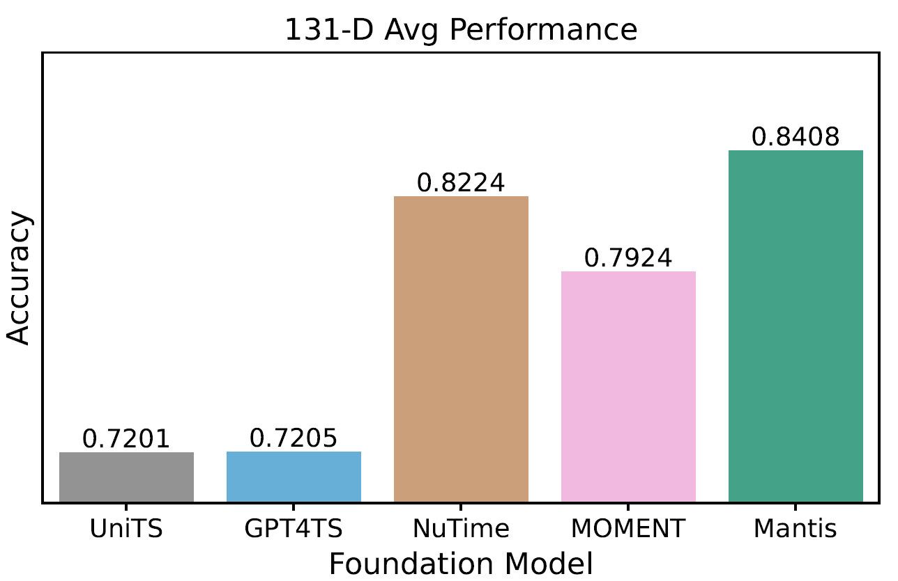

# Mantis: Lightweight Calibrated Foundation Model for User-Friendly Time Series Classification

<p align="center">
  
</p>

## Overview

**Mantis** is an open-source, pre-trained time series classification foundation model implemented by [Huawei Noah's Ark Lab](https://huggingface.co/paris-noah).
The key features are:

 - *Zero-shot feature extraction:* The model can be used in a frozen state to extract deep features and train a classifier on them.
 - *Fine-tuning:* To achieve the highest performance, the model can be further fine-tuned for a new task.
 - *Lightweight:* The model contains 8 million parameters, which allows it to be fine-tuned on a single GPU. It is even possible to fine-tune on a CPU!
 - *Calibration:* In our studies, we have shown that Mantis is the most calibrated foundation model for classification so far.
 - *Adaptable to large-scale datasets:* For datasets with a large number of channels, we propose additional adapters that reduce memory requirements.

<p align="center">
   
  
  
</p>

Please find out technical report on [arXiv](https://arxiv.org/abs/2502.15637). Our pre-trained weights can be found on [Hugging Face](https://huggingface.co/paris-noah/Mantis-8M).
Below we give instructions how the package can be installed and used.

## Installation

### Pip installation 

> [!WARNING]
> The package will be released to PyPI very soon. Meanwhile, please use editable mode intallation given below.
> 

```
pip install mantis
```

### Editable mode using Poetry

First, install Poetry and add the path to the binary file to your shell configuration file. 
For example, on Linux systems, you can do this by running:
```bash
curl -sSL https://install.python-poetry.org | python3 -
export PATH="/home/username/.local/bin:$PATH"
```
Now you can create a virtual environment that is based on one of your already installed Python interpreters.
For example, if your default Python is 3.9, then create the environment by running:
```bash
poetry env use 3.9
```
Alternatively, you can specify a path to the interpreter. For example, to use an Anaconda Python interpreter:
```bash
poetry env use /path/to/anaconda3/envs/my_env/bin/python
```
If you want to run any command within the environment, instead of activating the environment manually, you can use `poetry run`:
```bash
poetry run <command>
```
For example, to install the dependencies and run tests:
```bash
poetry install
poetry run pytest
```
If dependencies are not resolving correctly, try re-generating the lock file:
```bash
poetry lock
poetry install
```


## Getting started

Please refer to `getting_started/` folder to see reproducible examples of how the package can be used.

Below we summarize the basic commands needed to use the package.

### Initialization.

To load our pre-trained model with 8M parameters from the Hugging Face, it is sufficient to run:

``` python
from mantis.architecture import Mantis8M

network = Mantis8M(device='cuda')
network = network.from_pretrained("paris-noah/Mantis-8M")
```

### Feature Extraction.

We provide a scikit-learn-like wrapper `MantisTrainer` that allows to use Mantis as a feature extractor by running the following commands:

``` python
from mantis.trainer import MantisTrainer

model = MantisTrainer(device='cuda', network=network)
Z = model.transform(X) # X is your time series dataset
```

### Fine-tuning.

If you want to fine-tune the model on your supervised dataset, you can use `fit` method of `MantisTrainer`:

``` python
from mantis.trainer import MantisTrainer

model = MantisTrainer(device='cuda', network=network)
model.fit(X, y) # y is a vector with class labels
probs = model.predict_proba(X)
y_pred = model.predict(X)
```

### Adapters.

We have integrated into the framework the possibility to pass the input to an adapter before sending it to the foundation model. This may be useful for time series data sets with a large number of channels. More specifically, large number of channels may induce the curse of dimensionality or make model's fine-tuning unfeasible. 

A straightforward way to overcome these issues is to use a dimension reduction approach like PCA:
``` python
from mantis.adapters import MultichannelProjector

adapter = MultichannelProjector(new_num_channels=5, base_projector='pca')
adapter.fit(X)
X_transformed = adapter.transform(X)

model = MantisTrainer(device='cuda', network=network)
Z = model.transform(X_transformed)
```

Another wat is to add learnable layers before the foundation model and fine-tune them with the prediction head:
``` python
from mantis.adapters import LinearChannelCombiner

model = MantisTrainer(device='cuda', network=network)
adapter = LinearChannelCombiner(num_channels=X.shape[1], new_num_channels=5)
model.fit(X, y, adapter=adapter, fine_tuning_type='adapter_head')
```

## Structure

```
├── data/                <-- two datasets for demonstration
├── getting_started/     <-- jupyter notebooks with tutorials
└── src/mantis/          <-- the main package
    ├── adapters/        <-- adapters for multichannel time series
    ├── architecture/    <-- foundation model architectures
    └── trainer/         <-- a scikit-learn-like wrapper for feature extraction or fine-tuning
```


## License

This project is licensed under the MIT License. See the [LICENSE](LICENSE) file for more details.

## Open-source Participation

We would be happy to receive feedback and integrate any suggestion, so do not hesitate to contribute to this project by raising a GitHub issue or contacting us by email:

 - Vasilii Feofanov - vasilii [dot] feofanov [at] huawei [dot] com


## Citing Mantis 📚

If you use Mantis in your work, please cite this technical report:

```bibtex
@article{feofanov2025mantis,
  title={Mantis: Lightweight Calibrated Foundation Model for User-Friendly Time Series Classification},
  author={Vasilii Feofanov and Songkang Wen and Marius Alonso and Romain Ilbert and Hongbo Guo and Malik Tiomoko and Lujia Pan and Jianfeng Zhang and Ievgen Redko},
  journal={arXiv preprint arXiv:2502.15637},
  year={2025},
}
```
