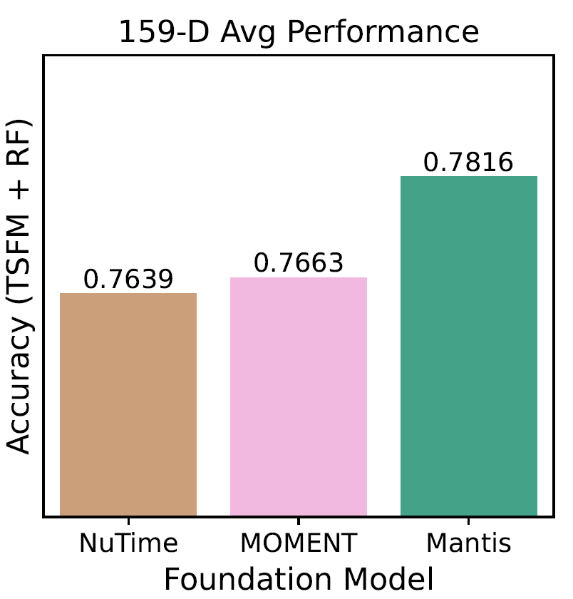
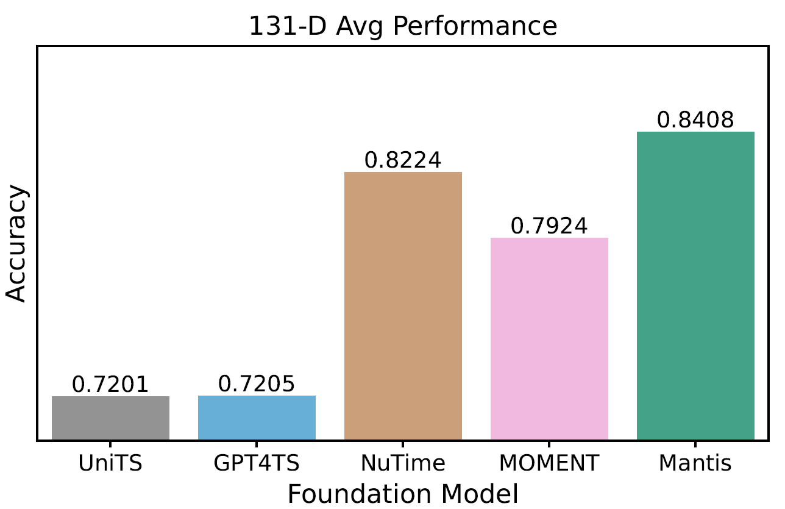
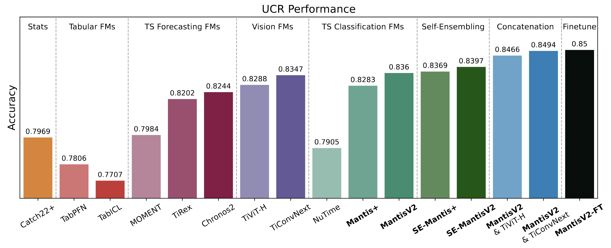

# Mantis: Lightweight Foundation Model for Time Series Classification

<div align="center">
  
[](https://arxiv.org/abs/2502.15637)
[](https://pypi.org/project/mantis-tsfm/)
[](https://opensource.org/license/apache-2-0)
<!-- [](https://arxiv.org/html/2602.17868v1) -->
[](https://huggingface.co/paris-noah/Mantis-8M)
[](https://huggingface.co/paris-noah/MantisPlus)
[](https://huggingface.co/paris-noah/MantisV2)
[]()


</div>

<br>

> **🚨 Version 1.1.0 is released: more tutorials, better default prediction head, UTICA's checkpoint support!**
> 
> **😎 Mantis was published at ICML'26, see the [paper](https://arxiv.org/pdf/2502.15637)!**

## Overview

**Mantis** is a family of open-source time series classification foundation models. 
<!-- The paper can be found on [arXiv](https://arxiv.org/abs/2502.15637) while pre-trained weights are stored on [Hugging Face](https://huggingface.co/paris-noah/Mantis-8M). -->

The key features of Mantis:

 - *Zero-shot feature extraction:* The model can be used in a frozen state to extract deep features and train a classifier on them.
 - *Fine-tuning:* To achieve the highest performance, the model can be further fine-tuned for a new task.
 - *Lightweight:* Our models contain a few million parameters, allowing us to fine-tune them on a single GPU (even feasible on a CPU).
 - *Calibration:* In our studies, we have shown that Mantis is the most calibrated foundation model for classification so far.
 - *Adaptable to large-scale datasets:* For datasets with a large number of channels, we propose additional adapters that reduce memory requirements.

<p align="center">
  <!--   -->
  
  <!--  -->
   
</p>

Below we give instructions on how the package can be installed and used.

## Installation

### Pip installation 

It can be installed via `pip` by running:

```
pip install mantis-tsfm
```
The requirements can be verified at [`pyproject.toml`](pyproject.toml).

### Editable mode using uv

First, install [uv](https://docs.astral.sh/uv/):
```bash
curl -LsSf https://astral.sh/uv/install.sh | sh
```
To create the virtual environment and install the package in editable mode together with all
dependencies, including the development ones, run:
```bash
uv sync
```
This uses the versions pinned in [`uv.lock`](uv.lock). By default, uv picks a compatible Python
interpreter, downloading one if needed. To choose the version yourself, run:
```bash
uv sync --python 3.10
```
If you want to run any command within the environment, instead of activating the environment manually, you can use `uv run`:
```bash
uv run <command>
```
For example, to run the tests:
```bash
uv run pytest
```
To update the pinned versions after changing the dependencies in [`pyproject.toml`](pyproject.toml), run:
```bash
uv lock
uv sync
```


## Getting started

Please refer to the [`getting_started/`](getting_started/) folder to see reproducible examples of how the package can be used.

Below we summarize the basic commands needed to use the package.

### Prepare Data.

As an input, Mantis accepts any time series whose sequence length is a **multiple** of 32, which corresponds to the number of tokens fixed in our model. 
We found that resizing time series via interpolation is generally a good choice:
``` python
import torch
import torch.nn.functional as F

def resize(X):
    X_scaled = F.interpolate(torch.tensor(X, dtype=torch.float), size=512, mode='linear', align_corners=False)
    return X_scaled.numpy()
```
Generally speaking, the interpolation size is a hyperparameter to play with. Nevertheless, since Mantis was pre-trained on sequences of length 512, interpolating to this length looks reasonable in most cases.

### Initialization.

At the moment, we have two backbones and four checkpoints, including the [UTICA checkpoint](https://github.com/fegounna/Utica):

|| Mantis| Mantis+| UTICA| MantisV2|
|-|-|-|-|-|
|**Module**| `MantisV1`| `MantisV1`| `MantisV1`| `MantisV2`|
|**Checkpoint**| `paris-noah/Mantis-8M`| `paris-noah/MantisPlus`| `fegounna/Utica`| `paris-noah/MantisV2`|


To load any of these pre-trained models from Hugging Face, you can do as follows:

``` python
from mantis.architecture import MantisV1

network = MantisV1(device='cuda')
network = network.from_pretrained("paris-noah/Mantis-8M")
```

As we showed in our paper, the superior performance of the frozen encoder is achieved by using one of the intermediate representations together with the aggregated output-token strategy.
For this, pass the `return_transf_layer=layer_idx` and `output_token='combined'` arguments when initializing the network. On UCR, the following intermediate layers give the best performance for each checkpoint (note that the count starts from 0):
|| Mantis| Mantis+| UTICA| MantisV2|
|-|-|-|-|-|
|**layer_idx**| 2 | 1 |  2|  2|

Please see [`getting_started/intermediate_layers.ipynb`](getting_started/intermediate_layers.ipynb) for more details.

The UTICA checkpoint is pre-trained with a self-distillation recipe and is hosted outside of the `paris-noah` collection, so we recommend pinning its revision:

``` python
network = MantisV1(device='cuda')
network = network.from_pretrained("fegounna/Utica", revision="3cff4f954191b5bf9839b7a41117e2b24e7693ab")
```

See [`getting_started/utica.ipynb`](getting_started/utica.ipynb) for a complete example, including how `return_transf_layer` and `output_token` affect its accuracy.

### Feature Extraction.

We provide a scikit-learn-like wrapper `MantisTrainer` that allows you to use Mantis as a feature extractor by running the following commands:

``` python
from mantis.trainer import MantisTrainer

model = MantisTrainer(device='cuda', network=network)
Z = model.transform(X) # X is your time series dataset
```

Once you have extracted the features, you can train any classifier you want. Note that feature normalization is important if you use a linear classifier:

| Sklearn Log. Regression (L-BFGS-B Opt.)  | |                | PyTorch Linear (Adam Opt.) |            |            | Random Forest |
|------------------------------------------|-----------------------------------------|-----------------|----------------------------|------------|------------|---------------|
| W/o Norm                                 | MinMax Scaler                           | Standard Scaler | W/o Norm                   | Layer Norm | Batch Norm |               |
|  0.763                                | 0.829                                | **0.837**        | 0.669                   | 0.71    | 0.827   | 0.82      |

Our features can also be concatenated with those of another model. In particular, [TiViT](https://github.com/ExplainableML/TiViT) extracts time series features with a frozen Vision Transformer, and since it looks at the data from a completely different angle, its representations are complementary to ours: combining them improves the accuracy over either model alone. See [`getting_started/mantis_and_tivit.ipynb`](getting_started/mantis_and_tivit.ipynb) for a self-contained example.

### Fine-tuning.

If you want to fine-tune the model on your supervised dataset, you can use the `fit` method of `MantisTrainer`:

``` python
from mantis.trainer import MantisTrainer

model = MantisTrainer(device='cuda', network=network)
model.fit(X, y) # y is a vector with class labels
probs = model.predict_proba(X)
y_pred = model.predict(X)
```

Since version 1.1.0, by default, the prediction head for fine-tuning is a batch normalization step + linear layer, as we found that it delivers superior performance:

| Fine-tuning head | UCR-128 accuracy |
|---|---:|
| Linear | 84.48 ± 0.33% |
| LayerNorm + Linear | 85.00 ± 0.01% |
| BatchNorm + Linear | **85.69 ± 0.06%** |


### Adapters.

We have integrated into the framework the possibility to pass the input to an adapter before sending it to the foundation model. This may be useful for time series data sets with a large number of channels. More specifically, a large number of channels may induce the curse of dimensionality or make fine-tuning of the model infeasible. 

A straightforward way to overcome these issues is to use a dimension reduction approach like PCA:
``` python
from mantis.adapters import MultichannelProjector

adapter = MultichannelProjector(new_num_channels=5, base_projector='pca')
adapter.fit(X)
X_transformed = adapter.transform(X)

model = MantisTrainer(device='cuda', network=network)
Z = model.transform(X_transformed)
```

Another way is to add learnable layers before the foundation model and fine-tune them with the prediction head:
``` python
from mantis.adapters import LinearChannelCombiner

model = MantisTrainer(device='cuda', network=network)
adapter = LinearChannelCombiner(num_channels=X.shape[1], new_num_channels=5)
model.fit(X, y, adapter=adapter, fine_tuning_type='adapter_head')
```

### Pre-training.

The model can be pre-trained using the `pretrain` method of `MantisTrainer` that supports data parallelization. You can see a pre-training demo at `getting_started/pretrain.py`.
For example, to pre-train the model on 4 GPUs, you can run the following commands:
```
cd getting_started/
python -m torch.distributed.run --nproc_per_node=4 --nnodes=1 pretrain.py --seed 42
```

We have open-sourced [CauKer 2M](https://huggingface.co/datasets/paris-noah/CauKer2M), the synthetic data set we used to pre-train the two versions of Mantis, resulting in [MantisPlus](https://huggingface.co/paris-noah/MantisPlus) and [MantisV2](https://huggingface.co/paris-noah/MantisV2) checkpoints. The `pretrain` method directly supports a HF dataset as an input. 

## Structure

```
├── data/                <-- two datasets for demonstration
├── getting_started/     <-- jupyter notebooks with tutorials
└── src/mantis/          <-- the main package
    ├── adapters/        <-- adapters for multichannel time series
    ├── architecture/    <-- foundation model architectures
    └── trainer/         <-- a scikit-learn-like wrapper for feature extraction or fine-tuning
```


## License

This project is licensed under the Apache License 2.0. See the [LICENSE](LICENSE) file for more details.

## Open-source Participation

We would be happy to receive feedback and integrate any suggestions, so do not hesitate to contribute to this project by raising a GitHub issue.


## Citing Mantis 📚

If you use Mantis in your work, please cite our papers :)

1. The ICML paper that combines the contributions of V1 and V2:
```bibtex
@inproceedings{feofanov2026mantis,
title={Mantis: Lightweight Foundation Model for Time Series Classification},
author={Vasilii Feofanov and Songkang Wen and Shifeng Xie and Simon Roschmann and Marius Alonso and Hongbo Guo and Romain Ilbert and Malik Tiomoko and Quentin Bouniot and Zeynep Akata and Lujia Pan and Jianfeng Zhang and Ievgen Redko},
booktitle={Forty-third International Conference on Machine Learning},
year={2026},
url={https://openreview.net/forum?id=gbJMAjXLZ4}
}
```

2. MantisV2 and Mantis+ report:
```bibtex
@article{feofanov2026mantisv2,
  title={Mantisv2: Closing the zero-shot gap in time series classification with synthetic data and test-time strategies},
  author={Feofanov, Vasilii and Wen, Songkang and Zhang, Jianfeng and Pan, Lujia and Redko, Ievgen},
  journal={arXiv preprint arXiv:2602.17868},
  year={2026}
}
```

3. Original tech report:
```bibtex
@article{feofanov2025mantis,
  title={Mantis: Lightweight Calibrated Foundation Model for User-Friendly Time Series Classification},
  author={Vasilii Feofanov and Songkang Wen and Marius Alonso and Romain Ilbert and Hongbo Guo and Malik Tiomoko and Lujia Pan and Jianfeng Zhang and Ievgen Redko},
  journal={arXiv preprint arXiv:2502.15637},
  year={2025},
}
```
